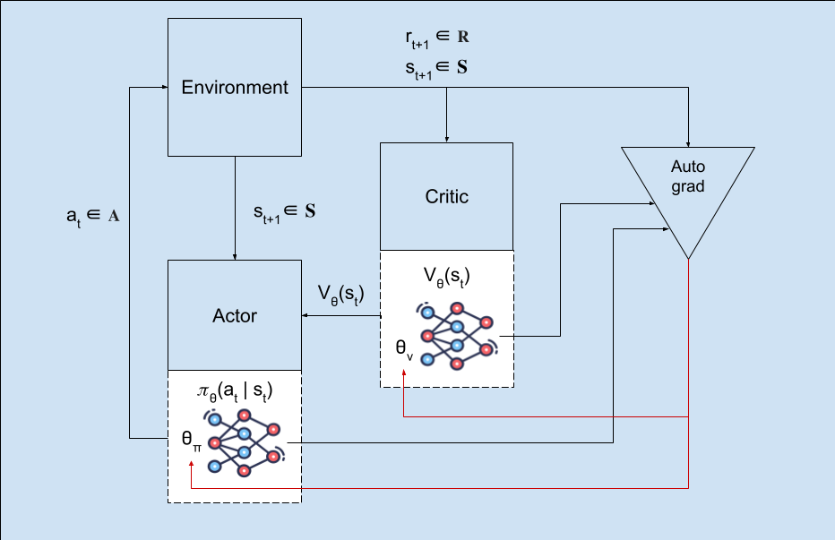

# Deep Q Network (DQN)



# Introduction

In reinforcement learning, the concept of Deep Q Network methods refers to a paradigm simmilar to standard TD-control, with the difference lying in the environment return that the agent is trying to maximize.

The return is generally defined by the following equation, and directly depends on the rewards collected during the **collection phase**, which will be stored in a **Replay Buffer** and may be used many episodes down the line in order to diminish the effects of the temporal-correlation in the data, stabilizing training.
    $$G_t = r_t + \gamma r_{t+1} + \gamma^2 r_{t+2} + \cdots$$

The return value can expressed in terms the action-value function, which will be what the agent tries to estimate during training. Two neural networks are used in order to stabilize training:
* An online network:
    Parametrized by $\theta$ which is updated at every step in order to decrease the Action-Value function estimator's error when compared to the bootstrapped Action-Values from the target function.  
    
* A target network:
    Parametrized by $\theta^-$ and updated periodically every `self.target_update_interval` steps, where the weight's values are periodically interpolated towards the online network's weights. This network is used in order to predict the Q-values on each step, setting a target for the online network's action-value function estimation. 

The main difference between TD-control and Q-learning is in how the environment return is computed, which gives more value to states that lead to high-value actions, even if the actions were not taken. That fact makes Q-learning an **off-policy** algorithm. The Q-learning return is bootstrapped following the equation using the target network:
$$G_t = r_t + \gamma Q_{\theta^-}(s_{t+1}, a_{t+1})$$

## Collection Phase
Conceptually, in the collection phase, **experience tuples** are collected while the model interacts with the environment. These 4-tuples consist of: (state, action, reward, next_state) and are employed during the TD-Error computation that will end up training the online network action-value function estimator.

Instead of states, we gather observations about the environment, as it is assumed that the model does not have complete knowledge about the environment from a single observation.

As seen in the `add` method of the `ReplayBuffer` class in `buffers.py` (stable baselines 3 implementation), on each model-environment interaction, a state observation, an action, the resulting reward and the next observation are stored:  

```python
def add(
        self,
        ...
    ) -> None:

        ...
        self.observations[self.pos] = np.array(obs)

        ...
            self.next_observations[self.pos] = np.array(next_obs)

        self.actions[self.pos] = np.array(action)
        self.rewards[self.pos] = np.array(reward)
        self.dones[self.pos] = np.array(done)
```

## Training phase

The `train()` method is periodically called depending on the frequency value `self.train_freq`. When training, the model's `train` method gathers experience tuples from the replay buffer in order to compute the estimated and actual action-value function's values:
```python
replay_data = self.replay_buffer.sample(batch_size, env=self._vec_normalize_env)
```

The Q-values for each next-state's observation computed by forwarding the observations through the target network, these are employed when bootstrapping the target Q-values by summing the actual rewards and discounting to obtain the environment return, which conceptually corresponds to the following equation:
$$y_t = r_t + \gamma Q_{\theta^-}(s_{t+1}, a_{t+1})$$

And is implemented in the following line as part of the train method in the DQN class of `dqn.py` (stable baselines 3 implementation):
```python
target_q_values = replay_data.rewards + (1 - replay_data.dones) * self.gamma * next_q_values
```

> **Note that**: The role of `(1 - replay_data.dones)` is to set the discounted future rewards from terminal states to 0, as there are no more observations after a terminal state

The **online Q-values** (or action-value function value estimates) are computed by simply forwarding the buffer's observation through the online network, and are then compared to the bootstrapped target Q-values from the target network in order to generate a loss value, which will be later employed when backpropagating the loss function's gradients.

```python
loss = F.smooth_l1_loss(current_q_values, target_q_values)
```

Which, for clarity, corresponds to the following loss-calculation computation:
$$L(\theta) = Hubert\_Loss(y_t, Q_{\theta(s_t, a_t)})$$

In which the Hubert-Loss is used for training-stabilization purposes, as it is less sensitive to outliers than other loss functions like Mean Squared Error.

After the online network's gradients have been computed, they are backpropagated through the tensors in the computational graph until reaching the weight tensors in the online (primary) network.
The gradient is clipped in order to stabilize training, and a single training step is taken in the gradient's direction at the end of the `train()` method, which length is set by the optimizer as seen in the following extract from the `DQN` class' `train()` method:

```python
...
loss.backward()
# Clip gradient norm
th.nn.utils.clip_grad_norm_(self.policy.parameters(), self.max_grad_norm)
self.policy.optimizer.step()
```

## _on_step hook
On each step, the `_on_step()` hook, defined by DQN's parent class `OffPolicyAlgorithm` is called.
This method is implemented (overwritten) by the `DQN` class in order to periodically update the target network's weights, interpolating them towards the online network's weights instead of following any gradient.

```python
def _on_step(self) -> None:
    ...
    if self._n_calls % max(self.target_update_interval // self.n_envs, 1) == 0:
        polyak_update(self.q_net.parameters(), self.q_net_target.parameters(), self.tau)
        ...

    self.exploration_rate = self.exploration_schedule(self._current_progress_remaining)
    self.logger.record("rollout/exploration_rate", self.exploration_rate)
```

The goal of this method is to periodically update the weights of the more stable "target network", interpolating them via Polyak averaging towards the online network's weights. This stabilizes the online network's updates through training. A tau parameter may be provided to the DQN class, which in turn provides control over the degree of the target network's interpolation:

$$\theta^- \leftarrow \tau \theta + (1 - \tau) \theta^-$$