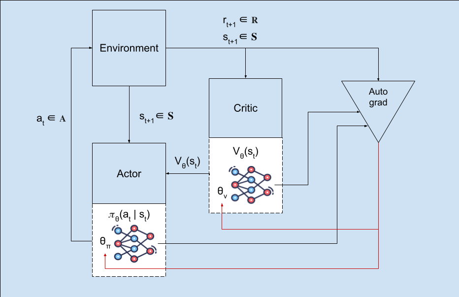

# Proximal Policy Optimization (PPO)


# Introduction

In reinforcement learning, the [Proximal Policy Optimization (PPO)](https://arxiv.org/abs/1707.06347) method is a variant of the [TRPO](https://arxiv.org/abs/1502.05477) with a focus on decreasing the computational complexity of keeping model updates close to the previous policy by clipping the update steps with respect to a value in the range $1\pm \epsilon$

Being a type of Model-Based, Actor-Critic, Policy Gradient Method; PPO estimates a Value function $V(s)$ directly by the means of a Neural Network that processes observations (critic), and improves its estimate on each step by computing its difference with respect to the actual values that the environment returns.  
PPO's policy distribution is determined by another neural network (actor), which is also improved on each step by computing and stepping the weights towards the gradient of the **PPO Surrogate Loss function**.

It is common practice to compute the policy loss in Actor-Critic methods as the negative expected value of the product between an action's logarithmic likelihood and its advantage value.  

In order to account for initialization bias, and to avoid the agent being stuck making small updates to actions that had greater likelihoods when training starts, the algorithm needs to update each probability in proportion to how likely that action is to happen in the first place.  
This is done by dividing each action probability's gradient by the corresponding probability of taking that action, which equals the gradient of each action's probability by the gradient operator's properties:

$$\nabla_\theta J(\theta_\pi) = - \mathbb{E} \left[\frac{\nabla_\theta \pi_\theta(a_t | s_t)}{\pi_{\theta}(a_t | s_t)} A_t\right]$$
$$\nabla_\theta J(\theta_\pi) = - \mathbb{E} \left[\nabla_\theta \log \pi_\theta(a_t | s_t) A_t\right]$$

However, Proximal Policy Optimization (as did its predecessor Trust Region Policy Optimization) optimizes for a surrogate loss function instead of the previous Actor-Critic policy loss function.
Instead of using the gradient of the logarithmic probabilities, the modified loss function expands this operation, substituting the action probabilities in the denominator by the ones in the previous iteration:

$$\mathcal{L}_{CPI}(\theta_\pi) = \mathbb{E}_t \left[ \frac{\pi_\theta(a_t | s_t)}{\pi_{\theta_{\text{old}}}(a_t | s_t)} \hat{A}_t \right]= \mathbb{E}_t \left[ r_t(\theta_\pi) \hat{A}_t \right]$$

This substitution allows the ratio between policies (denoted as $r(\theta_\pi)$) serve the additional purpose of indicating the relative update size for each action probability between the previous and current policy.  
Thus the ratio can be clipped to a value near 1 only for the action probabilities that changed by more than a factor of $\epsilon$ since the previous policy update.
$$\nabla_\theta L^{CLIP}(\theta_\pi) = \nabla_\theta \mathbb{E}_t \left[ \min \left( r(\theta_\pi) \hat{A}_t, \text{clip}\left( r(\theta_\pi), 1 - \epsilon, 1 + \epsilon \right) \hat{A}_t \right) \right]$$

Where $r(\theta)$ corresponds to the tensor containing the element-wise ratios between the log-likelihoods of each action being taken at its corresponding timestep in the current policy and those of the previous step's policy:

$$ r(\theta) = \frac{\pi_\theta(a_t | s_t)}{\pi_{\theta_{\text{old}}}(a_t | s_t)}$$

## Collection Phase
The collection phase follows the same steps as the one from the A2C method. Advantage values are also needed in order to compute the gradient for the PPO loss, and Generalized Advantage Estimation is also used for further control over the advantage function's lookahead reach.

Conceptually, in the collection phase, **experience tuples** are collected while the model interacts with the environment. These 4-tuples consist of: (state, action, reward, next_state) and are employed during the TD-Error computation that will end up training the "Critic" Value function estimate part of the model.

As seen in the `add` method of the `RolloutBuffer` class in `buffers.py` (stable baselines 3 implementation), on each model-environment interaction, a state observation, an action and the resulting reward are stored, as well as the Value function estimate for each state:  

```python
def add(
        self,
        ...
    ) -> None:
        ...

        self.observations[self.pos] = np.array(obs)
        self.actions[self.pos] = np.array(action)
        self.rewards[self.pos] = np.array(reward)
        ...
        self.values[self.pos] = value.clone().cpu().numpy().flatten()
        ...
```

In order to compute the policy's loss and train the "Actor" part of the network, an Advantage values are computed using the rewards and state value estimates.
Conceptually, it is most common to find the advantage function definition in terms of the **Action-Value function:** $Q(s, a)$:

$$A(s_t, a_t)=Q(s_t, a_t)−V(s_t)$$

We apply the Bellman Equation for the Action-Value function: $Q(s_t, a_t) = \mathbb{E}[R_{t+1} + \gamma V(s_{t+1}) | s_t = s , a_t = a]$ to arrive at:

$$A(s_t) = (R_{t+1}+\gamma V(s_{t+1}))−V(s_t) = \delta_t$$

Thus in practice, when using a model-based approach where state-value estimates are available (for example by forwarding observations through the critic network), the Advantage values can be extracted using the **Temporal Difference Error** from 2 consecutive states $\delta_t$.  
This value only depends on state value estimates $V(s)$ as well as environment rewards $R_t$.  
When computing the Advantage, the state value estimate $V(s_t)$ provides a **baseline** for the Advantage values, improving training stability and speeding up learning, especially with imbalanced rewards.  

These values are computed in the `compute_returns_and_advantage` method as part of the collection phase.

```python
def compute_returns_and_advantage(self, ...) -> None:
        ...
        for step in reversed(range(self.buffer_size)):
            ...
                next_non_terminal = 1.0 - self.episode_starts[step + 1]
                next_values = self.values[step + 1]

            delta = self.rewards[step] + self.gamma * next_values * next_non_terminal - self.values[step]
            last_gae_lam = delta + self.gamma * self.gae_lambda * next_non_terminal * last_gae_lam
            self.advantages[step] = last_gae_lam
            
        self.returns = self.advantages + self.values
```
In Stable-Baselines 3's implementation of the `RolloutBuffer` class (`buffers.py`), **Generalized Advantage Estimation (GAE)** is employed so the user can specify a `gae_lambda` value which allows for a smooth transition between a high Variance *Monte-Carlo* approach ($\lambda = 1$) and a high Bias *1-step Temporal-Difference* ($\lambda = 0$) approach when computing the **Advantage values**. The latter of which uses only 1-step rewards while the former *Monte-Carlo* approach uses all future rewards in the episode to compute the advantage values.

Instead of computing the advantage directly using only the *1-step TD-error*: ($\delta_t = (r_t+\gamma V(s_{t+1}))−V(s_t)$), $\delta_t$ may be extracted for multiple consecutive timesteps, weighted by the previously mentioned `gae_lambda` value and discounted using the `gamma` factor before being compounded in a weighted sum that computes the Generalized Advantage value for each state:
$$A_t = \sum_{l=0}^{T-t} (\gamma \lambda)^l \delta_{t+l}$$ 

## Training Phase
As mentioned in [the work of Schulman et al. (2017)](https://arxiv.org/pdf/1707.06347]), PPO's surrogate objective function allows for minibatch optimization over a given number of epochs instead of computing policy and value loss at once for an entire rollout.  
Thus, the number of epochs per mini-batch optimization and the batch-size per parallel-environment are controlled by the `n_epochs`

### Policy Evaluation
After each rollout is completed, the `compute_returns_and_advantage` method is called, allowing the model's `train` method to use the gathered experience tuples in order to train the actor and the critic on the rollout data. This code can be found in `ppo.py`'s `PPO` class as well as in `policy.py`'s `ActorCriticPolicy` class in the stable baselines 3 implementation. 

```python
def train(self) -> None:
    ...
    for rollout_data in self.rollout_buffer.get(batch_size=None):
        actions = rollout_data.actions
        ...

        values, log_prob, entropy = self.policy.evaluate_actions(rollout_data.observations, actions)
```
First, the **Policy Evaluation** process takes place, which consist of computing the value estimates for the states (`rollout_data.observations`) by forwarding the states' observations through the critic's network, which goal is to estimate the value function of each state $s$ following the policy $\pi$.  
These values will later be leveraged during the computation for the Critic's (Value Function Estimator's) loss function's gradients. Conceptually, the policy evaluation process extracts the values estimates by following the expected value of the discounted reward following the policy $\pi$:

$$V_\pi(s) = \mathbb{E}_\pi \left[ \sum_{t=0}^T \gamma^t R_{t+1} \mid S_0 = s \right]$$

### Computing Policy Loss

After policy evaluation, the Advantage values collected during the rollout phase are normalized and multiplied by the log-probabilities of the policy distribution in order to extract the policy loss' gradients. Being a kind of **Actor Critic** method, PPO will use the advantage values in order to improve both value function estimates and the policy distribution's expected reward under $V_\pi(s)$ The advantage values may be optionally normalized using their means and standard deviations.
```python
    ...
    # Normalize advantage (not present in the original implementation)
    advantages = rollout_data.advantages
    if self.normalize_advantage:
        advantages = (advantages - advantages.mean()) / (advantages.std() + 1e-8)

    ...
```

When computing PPO's Policy Loss, first the ratio $r(\theta)$ between the previous policy and the new policy is calculated. The logarithmic probabilities are exponentiated in order to turn them into probability values. Exponentiation properties ensure that the ratio is properly derived by substracting old logarithmic probabilities in the exponent:

```python
    ...

    # ratio between old and new policy, should be one at the first iteration
    ratio = th.exp(log_prob - rollout_data.old_log_prob)

    ...
```

$$r(\theta) = \frac{\pi_\theta(a_t | s_t)}{\pi_{\theta_{\text{old}}}(a_t | s_t)} = \exp\left(\log \pi_\theta(a_t | s_t) - \log \pi_{\theta_{\text{old}}}(a_t | s_t)\right)$$

This **ratio** indicates for each timestep in the batch whether the new policy made an action more or less likely to be sampled. The ratio will have values larger than 1 for timesteps where the action taken is more likely to be sampled from the new policy rather than from the previous one. Values generally close to 1 indicate small updates to the policy, which will is a fundamental concept for PPO as will be explained in subsequent paragraphs.  
Note that in Stable Baselines 3's implementation, the log-probabilities of the actions taken on each timestep as provided by the previous policy ($\log\pi_{\theta_{old}}(a_t|s_t)$) are stored as an attribute in the `RolloutBuffer` class so it can be accessed in the following iteration.


The advantage value tensor $\hat{A}_t$, simmilarly to the *ratio* tensor, will be a vector containing `batch_size` elements. We find this tensor represented in the code as the `advantages` variable, which is element-wise multiplied with the *ratio* to produce a target tensor where larger values represent changes in the policy that made actions associated with a larger advantage value more likely to be sampled from the new policy. 

```python
    # clipped surrogate loss
    policy_loss_1 = advantages * ratio
    policy_loss_2 = advantages * th.clamp(ratio, 1 - clip_range, 1 + clip_range)
    policy_loss = -th.min(policy_loss_1, policy_loss_2).mean()
```

Finally, we see intial PPO loss computation as implemented in Stable Baselines 3's `PPO` class. The Pytorch method used for clipping the updates in the policy is `torch.clamp` and clips the magnitude of each individual update component in the `ratio` tensor to a value near 1. This value will lie within a specified range controlled by the hyperparameter $\epsilon$ which is parametrized as the variable `clip_range` and provided to the user as an editable hyperparameter through the `__init__` method. 

The clipping of the update range serves as a way to keep policy updates from striding too far from the previous policy, while not being as computationally complex as *TRPO*'s method of achieving the same goal.

The minimum operator makes sure that no unneccesary clipping is applied to policy updates that were already within the update range, which minimizes changes to the components of the Policy loss, which would and ultimately change the gradient's direction. 

Pytorch's mean operator is performed to replace the Expected value operator when performing Monte-Carlo methods, which is justified by the *Law of Large Numbers* as a result that will converge with sufficiently large `batch_size` values

$$\mathbb{E}_t \left[ \min \left( r(\theta) \hat{A}_t, \text{clip}\left( r(\theta), 1 - \epsilon, 1 + \epsilon \right) \hat{A}_t \right) \right]$$

Which corresponds to:

The value loss is computed in a simmilar fashion as in `A2C`'s implementation, as the *Mean Squared Error* between the actual observed returns from each timestep in the rollout and the state values as predicted during **Policy Evaluation** predicted values:
```python
    # Value loss using the TD(gae_lambda) target
    value_loss = F.mse_loss(rollout_data.returns, values)
```

Conceptually:
$$L(\theta_v) = \frac{1}{2} \mathbb{E} \left[ \left( G_t - V_\pi(s_t; \theta_v) \right)^2 \right]$$

Finally, the entropy loss is computed from the policy distribution's Shannon entropy and added to the loss in order to provide control to the user over the exploration vs exploitation tradeoff during training. This control is provided via the ent_coef parameter, which multiplies the entropy loss before adding it to the total loss.

```python
    ...
    # Entropy loss favor exploration
    if entropy is None:
        # Approximate entropy when no analytical form
        entropy_loss = -th.mean(-log_prob)
    else:
        entropy_loss = -th.mean(entropy)

    loss = policy_loss + self.ent_coef * entropy_loss + self.vf_coef * value_loss

```
### Backpropagation and gradient step
After the total loss is computed, the backwards method is called in order to back-propagate the loss-function's gradients through the computational graph's tensors until the Actor's and Critic's network weights are reached.  
The gradients are clipped to `max_grad_norm` hyperparameter value with the goal of stabilizing training, before adding the learning-rate-weighted values to the networks' weights during the self.policy.optimizer.step() method call in order to perform a single gradient step.

```python

    # Optimization step
    self.policy.optimizer.zero_grad()
    loss.backward()

    # Clip grad norm
    th.nn.utils.clip_grad_norm_(self.policy.parameters(), self.max_grad_norm)
    self.policy.optimizer.step()
```